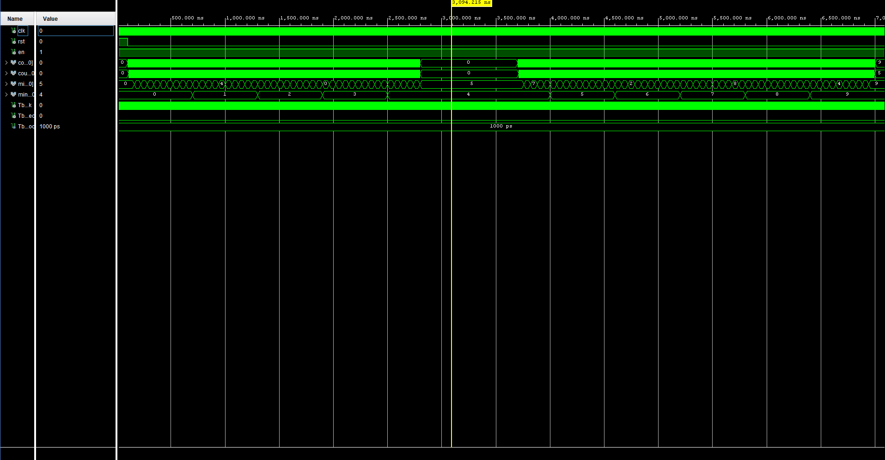
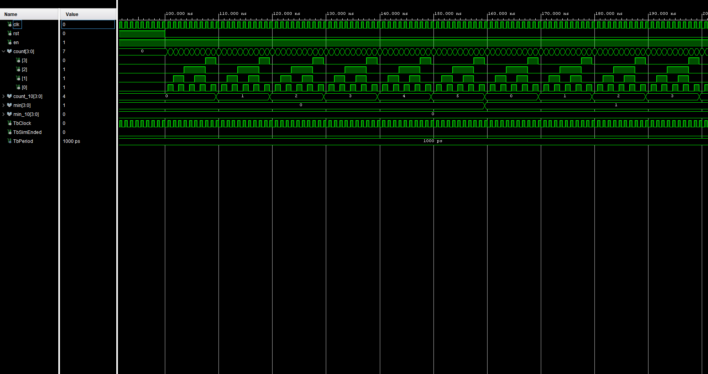
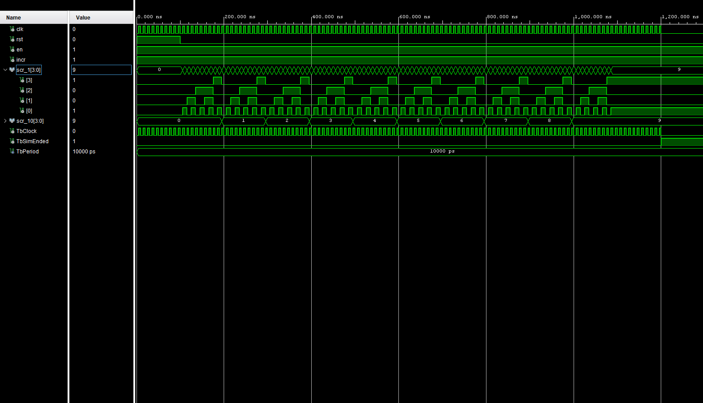
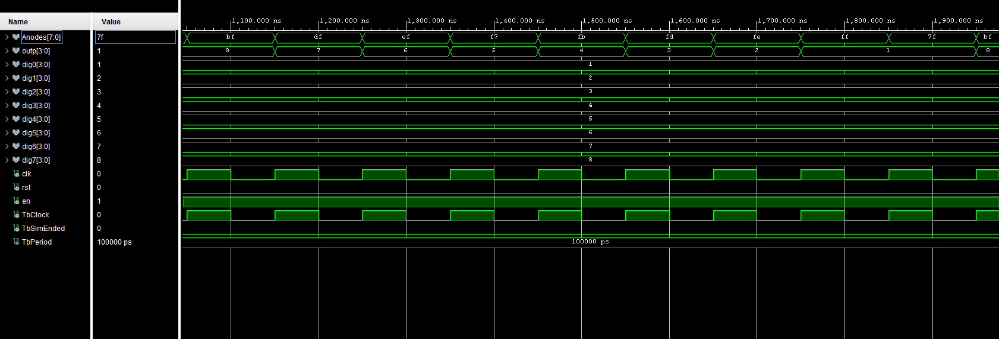

# DE1 VHDL lab project
## Team members
- Balajka Andrej
- Mikeš Martin
- Močary Filip
- Mucha Štefan

# Abstract
This project is focused on creating a digital scoreboard using FPGA board Nexys A7 50T. 
The goal is to create a digital timer that counts to 99:59 and a digital scoreboard that can count up to 99:99.
The digital timer stops at 45:00 for 900 seconds (15 minutes) and a blue LED lights up which signals that the match reached the end of the first half and also that pause is in effect. The clock also stops for 100 seconds after reaching 99:59.
# Hardware description of demo application

 
The top-level application consists of:
- 2x clock: 1 Hz clock for the timer( 50 Hz for the demo), 1 kHz clock for controling the output for the 7-segment display.
- 2x debouncer: One for the left and one for the right score.
- counter sec: Increments each cycle of the 1Hz clock. Also includes logic for pausing the game at the given time.
- 2x scoreboard: Increments score after pressing button and receiving signal from debouncer.
- anode picker: cycle through anodes of the 7-segment display and displays the correct digit at the correct position.
- bin2seg: convert binary code to 7-segment display code. 

# Software description
### [clock_enable:](https://github.com/baland1/DE1_Digital_clock/blob/main/DE1%20project/Digital_Scoreboard/Digital_Scoreboard.srcs/sources_1/new/clock_enable.vhd)
- taken from the vhdl course. Used for the timer component counter_sec (1 Hz clock, 50 Hz for demonstration purposes) and for the anode_picker component (1 kHz to ensure seamless display) 
### [debouncer:](https://github.com/baland1/DE1_Digital_clock/blob/main/DE1%20project/Digital_Scoreboard/Digital_Scoreboard.srcs/sources_1/new/debounce.vhd)
- Taken from the vhdl course, originally from [stackoverflow](https://stackoverflow.com/questions/61630181/vhdl-button-debouncing-or-not-as-the-case-may-be). Used to debounce buttons for scoreboard_l and scoreboard_r  
### [counter_sec:](https://github.com/baland1/DE1_Digital_clock/blob/main/DE1%20project/Digital_Scoreboard/Digital_Scoreboard.srcs/sources_1/new/counter_sec.vhd)
- This component increments the seconds up to 9. After reaching 9, the signal count_10 is incremented by 1 up to a maximum of 5. The signal count is reset. When count reaches 9 and count_10 reaches 5, the signal min is incremented, up to a maximum of 9. count and count_10 are reset. Once min reaches 9, the variable min_10 is incremented up to a maximum of 9. The counter stops at 45:00, and the signal sig_ht is incremented instead. When this signal reaches 900, the main counter resumes. A LED is lit up for the duration to signify correct operation. Similarly, the counter stops at 99:59 while sig_ht is incremented up to 100, after which the counter resets back to 00:00. 
  
 
[the entire simulation](https://github.com/baland1/DE1_Digital_clock/blob/main/DE1%20project/Digital_Scoreboard/Digital_Scoreboard.srcs/sim_1/new/counter_sec_tb.vhd)

  
 
first 50 seconds of the simulation

   
### [scoreboard](https://github.com/baland1/DE1_Digital_clock/blob/main/DE1%20project/Digital_Scoreboard/Digital_Scoreboard.srcs/sources_1/new/scoreboard.vhd)
- After receiving pulse and button signals from debouncer, and while signal scr is less than 99, it's incremented. The signal is then split into scr_10 and scr_1 using the modulo operation. These signals are then sent to the anode picker component.   
 
[the entire simulation](https://github.com/baland1/DE1_Digital_clock/blob/main/DE1%20project/Digital_Scoreboard/Digital_Scoreboard.srcs/sim_1/new/scoreboard_tb.vhd)

   
### [anode_picker](https://github.com/baland1/DE1_Digital_clock/blob/main/DE1%20project/Digital_Scoreboard/Digital_Scoreboard.srcs/sources_1/new/anode_picker.vhd)
- This component cycles through the anodes of the 7-seg display, Assigning the proper value to each anode. Some positions also have the decimal point light up to act as a colon, separating minutes and seconds and the left team's and right team's scores.   
 
[the entire simulation](https://github.com/baland1/DE1_Digital_clock/blob/main/DE1%20project/Digital_Scoreboard/Digital_Scoreboard.srcs/sim_1/new/anode_picker_tb.vhd)

   
### [bin2seg](https://github.com/baland1/DE1_Digital_clock/blob/main/DE1%20project/Digital_Scoreboard/Digital_Scoreboard.srcs/sources_1/imports/new/bin2seg.vhd)
- Taken from the vhdl course. Converts binary code to 7-segment code.
  
# References
-[Tomáš Fryza github](https://github.com/tomas-fryza/vhdl-labs/tree/master) 
-[digital clock vhdl](https://www.instructables.com/Digital-Clock-in-VHDL/) 
-[Copilot Microsoft AI](https://copilot.microsoft.com) 
-[stackoverflow](https://stackoverflow.com/questions/61630181/vhdl-button-debouncing-or-not-as-the-case-may-be)

